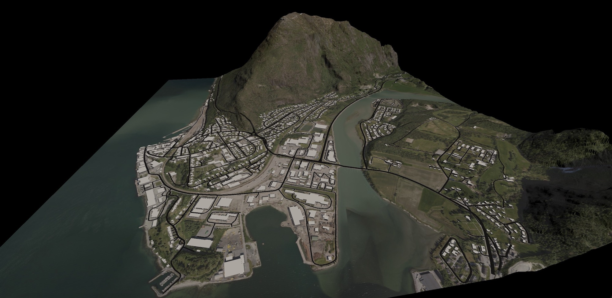

# Building virtual worlds

This repo contains an example implementation of the process flow discussed in my JavaZone 2024 talk "Building virtual worlds using open geodata". The code consists of two parts, written in plain JavaScript: Preprocessing scripts (for Node) and a simple web app (using three.js for data visualization).

License: [Creative commons BY-NC-SA 4.0](https://creativecommons.org/licenses/by-nc-sa/4.0/). In short, you are free to reuse and adapt this material, but not commercially. You must include attribution, and you must share any derived material under this same license.

## Example output

The code in this repo creates a GLB containing a 3D model of a 3x3 km region of Norway. It uses the Norwegian mapping authority (Kartverket) and Open Street Maps as its data sources. The scripts should be fairly easy to adapt to other data sources - as they show how to use the most common protocols and APIs for geodata.

# Preprocessing

The preprocessing module follows the Unix philosophy: It contains a set of scripts that each solves a single task, and writes output to a file that will be used by a later step.

All scripts read their configuration settings from a file, here called `config.json`. The name of the config file is a mandatory parameter.

Here is an overview of the scripts, in the sequence they should be run:

## Getting data

Data fetchers (in `src/fetchers`):

- getTerrain (get a GeoTIFF, via WCS)
- getSatellite (get a Sentinel-2 image, via WMS, as as PNG)
- getOrtho (get an aerial photo, via WMTS, by stitching JPEG tiles into a a PNG)
- getRoads (get roads from OSM, as GeoJSON)
- getBuildings (get buildings from OSM, as GeoJSON)

Run the scripts by going to the root folder of the repo and type `node src/fetchers/getTerrain.mjs config.json` and similar. To create the full model, you will need to run through all the scripts in this list.

Please note that the example data source for aerial photos used here does not permit commercial usage of the images. In general, make sure you know the licence terms for your data sets before using them.

The example source for the terrain data produces a type of GeoTIFF that is unfortunately not compatible with the JavaScript library used to parse GeoTIFFs in the following step. So you will have to re-encode the downloaded GeoTIFF using the command-line tool `gdal_translate` - part of [GDAL](https://www.gdal.org/). The commands you need to issue before going to the next step, are:

- `gdal_translate world-terrain.tiff world-terrain-fixed.tiff`
- `rm world-terrain.tiff`
- `mv world-terrain-fixed.tiff world-terrain.tiff`

## Converting an elevation map to a triangle mesh

Mesh converters (in `src/converters`):

- terrainToMesh (convert GeoTIFF height map to OBJ mesh)

This script performs very simple mesh simplification - by subsamling the original height map and skipping height values so that only each `N` value (in both X and Y directions) are used when creating the OBJ file. This is useful to avoid overly detailed meshes. A more sophisticated mesh simplification algorithm is highly recommended for general use.

To run the `terrainToMesh` script, you need to provide the skip count as input. A good starting point can be 10, meaning that only every 10th height value is used. That means the output mesh will have 10 meter resolution instead of matching the source data's 1 meter resolution. This skip value will reduce the total triangle count by a factor of 100. The command would be: `node src/converters/terrainToMesh.mjs 10 config.json`.

## Clamping geometries onto terrain

Geometry clamping (in `src/clampers`):

- roadsOntoMesh (clamp GeoJSON line strings onto terrain surface)
- buildingsOntoMesh (clamp GeoJSON outlines onto terrain surface, and extrude up to the building height and down to lowest terrain elevation for the outline)

## Converting roads and buildings to meshes

Mesh converters (in `src/converters`):

- roadsToMesh (convert clamped roads to OBJ mesh)
- buildingsToMesh (convert clamped and extruded buildings to OBJ mesh)

# Output

The scripts will generate various output files in the root directory for the repo. The important output is three OBJ files (one each for terrain, buildings, and roads) and two PNG files (one for satellite imagery and one for aerial imagery).

## Visualization

The visualization app is a simple webapp using three.js that will:

- read the terrain mesh (OBJ)
- read the satellite / aerial images (PNG), and drape them onto the terrain
- read the building geometries (OBJ) and add them to the scene
- read the road geometries (OBJ) and add them to the scene

To run the app, first copy the output files from the preprocessing (5 files in total) and the config file (`config.json`) to the `app/` folder, and then start the app using `yarn dev`.

You should now see a textured terrain model.

## App controls:

Press and hold the mouse button to move the camera, and use scroll to zoom in/out.

- press 'b' to toggle buildings on/off
- press 'r' to toggle roads on/off
- press 'o' to view orthophoto (aerial imagery)
- press 's' to view satellite imagery
- press 'x' to export the scene to a GLB
- press 'w' to toggle viewframe display of the terrain

The GLB file will be stored in the default download folder for the browser. To view it, open a GLB viewer such as https://gltf-viewer.donmccurdy.com/ in your browser, and drag-and-drop the file there.
